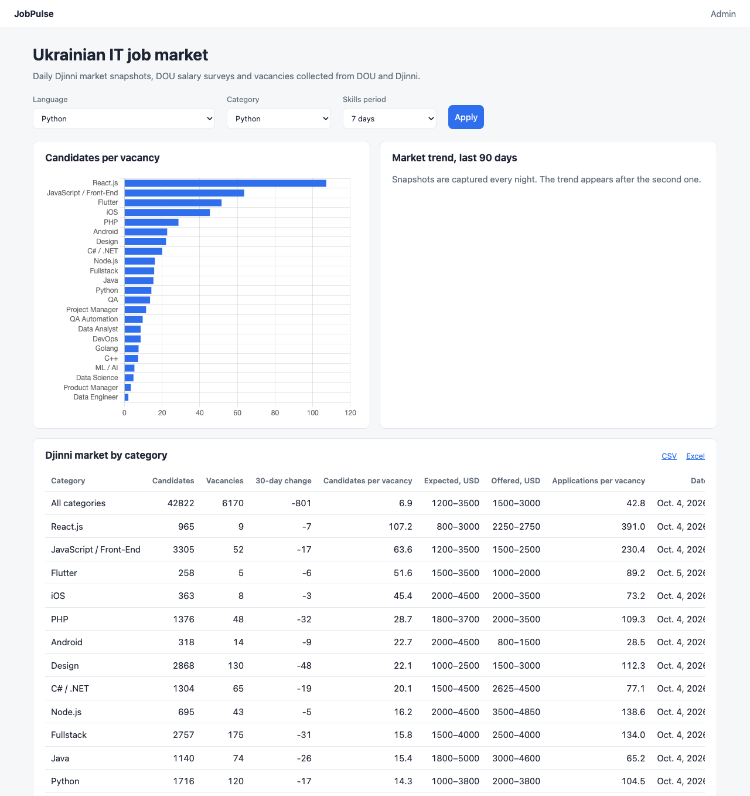
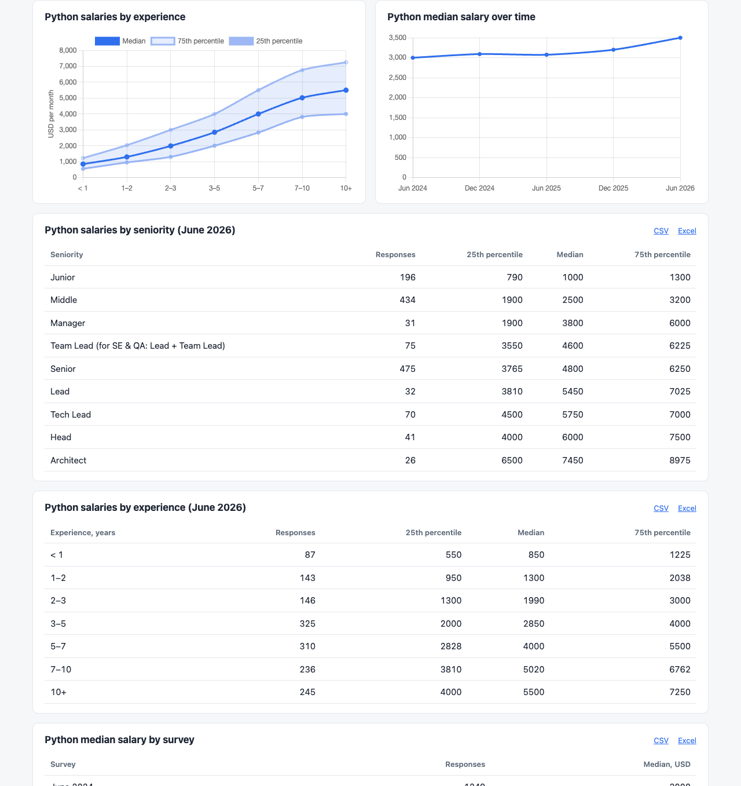

# JobPulse

JobPulse collects vacancies from Ukrainian IT job boards, normalizes them and turns them, together with public market statistics and salary surveys, into a market analytics dashboard.



## Features

- Collects vacancies from the public RSS feeds of **DOU** and **Djinni** every hour
- Reads schema.org `JobPosting` data from Djinni job pages to add the company, locations, remote option, published salary, required experience and English level
- Parses salary ranges such as `$1200–2800`, `від 40 000 грн` or `up to 2500 EUR` and converts them to USD with official **NBU** exchange rates
- Detects 65 technologies from a skill dictionary with aliases, case-sensitive rules and stop phrases, for example `Postgres` → PostgreSQL and `ASP.NET` → .NET, but never `go` or `Go-to-market` → Go
- Recognizes the same company and the same vacancy across job boards, so `Precoro Inc.` on DOU and `Precoro` on Djinni are one employer
- Full-text search with stemming, phrases, `OR` and `-exclusions`, ranked by title and description matches
- Captures daily Djinni market statistics for 24 categories: active candidates, open vacancies, expected and offered salaries, applications per vacancy
- Imports five DOU salary surveys (2024–2026, 64k responses) and computes medians and quartiles in PostgreSQL
- Analytics dashboard with competition, trends, salaries by seniority and experience, salary dynamics and skill demand, each table exportable to CSV and Excel
- Versioned REST API with filters, full-text search, OpenAPI documentation and JWT-protected endpoints for subscriptions and notifications
- Records every collection and enrichment run with its status, counts, duration and error
- Provides a Django admin to browse vacancies, companies, skills, exchange rates and run history

## Tech stack

Python 3.13 · Django 6.1 · Django REST Framework · PostgreSQL 18 · Celery + Redis · Requests · BeautifulSoup + lxml · Selenium · Chart.js · openpyxl · Docker · uv · pytest · ruff · mypy (strict) · GitHub Actions

## Architecture

```
                 ┌──────────────────── Celery beat ────────────────────┐
                 ▼                  ▼                 ▼                ▼
 RSS feeds ─► Collectors   Job pages ─► Enricher   NBU API   Djinni statistics
                 │                  │                 │                │
                 └─► VacancyIngestor┴─► PostgreSQL ◄──┴────────────────┘
                                         ▲      │
                     DOU salary surveys ─┘      ├─► Analytics dashboard, CSV, Excel
                                                ├─► REST API ◄─► Telegram bot
                                                └─► Django admin
```

```
config/        Django settings, URLs and the Celery app
core/          HTTP client, robots.txt policy, advisory locks, percentile aggregates
market/        Exchange rates, Djinni market snapshots, DOU salary surveys
analytics/     Dashboard queries, page, charts and exports
api/           REST API: serializers, filters, permissions, OpenAPI schema
subscriptions/ Subscribers, subscriptions and delivered notifications
vacancies/
  collectors/  RSS, HTML and JSON-LD parsing, one collector per job board
  services.py  Ingestion, enrichment and run tracking
  salary.py    Salary parsing and formatting
  dedup.py     Company and vacancy fingerprints
  skills.py    Skill detection
  tasks.py     Scheduled Celery tasks
tests/         pytest suite with recorded feeds and job pages
```

Main design decisions:

- **One collector per source.** A collector turns a feed or a page into plain data objects and knows nothing about the database. You add a job board by writing a collector class and registering it.
- **Unknown is not empty.** A feed that does not provide a field never erases what a job page already filled in, while an explicit "no salary" from the source does clear it.
- **Atomic ingestion.** A batch of vacancies is saved in one transaction, so a failed run never leaves partial data.
- **The database does the heavy lifting.** The search vector is a generated column with a GIN index, categories and locations are arrays, constraints reject duplicates and inverted salary ranges, `DISTINCT ON` picks the latest rate, snapshot and posting, `PERCENTILE_CONT` computes salary quartiles, and advisory locks stop scheduled runs from overlapping.
- **One table definition, three outputs.** Each dashboard table is described once and rendered as HTML, CSV and Excel, so exports always match the page.

## REST API

Interactive documentation is available at http://localhost:8000/api/docs/ and the OpenAPI schema at `/api/schema/`.

| Endpoint | Access | Purpose |
|---|---|---|
| `GET /api/v1/vacancies/` | Public | Vacancies with `q`, `skills`, `source`, `company`, `category`, `remote`, `english_level`, `min_salary_usd`, `published_after` and `ordering` |
| `GET /api/v1/skills/`, `/skills/demand/` | Public | Skills with vacancy counts and their demand trend |
| `GET /api/v1/companies/` | Public | Companies with search |
| `GET /api/v1/market/overview/`, `/market/snapshots/` | Public | Latest Djinni statistics per category and their history |
| `GET /api/v1/salaries/`, `/salaries/dynamics/` | Public | DOU salary percentiles by seniority or experience, medians across surveys |
| `POST /api/v1/auth/token/` | Bot account | JWT access and refresh tokens |
| `/api/v1/subscribers/…` | Bot account | Subscribers and their subscriptions |
| `GET`/`POST /api/v1/notifications/` | Bot account | New matching vacancies and delivery acknowledgements |

```bash
curl "http://localhost:8000/api/v1/vacancies/?skills=python,django&remote=true&min_salary_usd=3000"
```

Public endpoints are rate limited. Bot endpoints require an account with the `access_bot_api` permission, created with `create_bot_account`.

## Data sources

JobPulse uses only data that sources publish for automated consumption.

| Source | Access | Status |
|---|---|---|
| DOU | RSS `jobs.dou.ua/vacancies/feeds/` | Used |
| Djinni | RSS `djinni.co/jobs/rss/` and `JobPosting` data on job pages | Used |
| Djinni | Public salary statistics page `djinni.co/salaries/` | Used |
| DOU | Raw salary survey files published in `github.com/devua/csv` | Used |
| National Bank of Ukraine | Official exchange rate API | Used |
| Upwork, Indeed, Fiverr, LinkedIn | Terms of service or robots.txt forbid scraping | Not used |

Every request carries an identifiable `User-Agent`. Job pages are fetched only when robots.txt allows it. Requests to the same host are throttled, and temporary errors (429, 5xx) are retried with exponential backoff that respects `Retry-After`. Djinni's estimated salaries for similar vacancies are ignored: only salaries published by the employer are stored. JobPulse never collects candidates' personal data.

## Getting started

### Docker

```bash
cp .env.example .env
docker compose up -d --build --wait
docker compose exec web python manage.py createsuperuser
docker compose exec web python manage.py update_exchange_rates
docker compose exec web python manage.py collect_vacancies
docker compose exec web python manage.py capture_market_snapshots
docker compose exec web python manage.py import_salary_surveys
```

Open http://localhost:8000/ for the dashboard and http://localhost:8000/admin/ for the data. The `worker` and `beat` services keep the data up to date from then on.

### Local development

Requires [uv](https://docs.astral.sh/uv/) and Docker for PostgreSQL and Redis.

```bash
make install
make env
make services
make migrate
make rates
make collect
make run
```

Run `make worker` and `make beat` in separate terminals to enable the schedule.

## Commands

| Command | Purpose |
|---|---|
| `collect_vacancies [-s SOURCE] [-c CATEGORY]` | Read job board feeds |
| `enrich_vacancies [-s SOURCE] [--limit N]` | Fetch job pages for vacancies that have not been enriched yet |
| `update_exchange_rates [--date YYYY-MM-DD]` | Load NBU exchange rates |
| `rematch_skills` | Recalculate vacancy skills after editing the skill dictionary |
| `capture_market_snapshots [-c CATEGORY]` | Save today's Djinni market statistics |
| `import_salary_surveys [-s NAME]` | Import DOU salary surveys such as `2026_june` |
| `create_bot_account [--username NAME]` | Create the API account for the Telegram bot, the password is taken from `BOT_API_PASSWORD` or generated |

Collection commands exit with a non-zero code if any source fails, so they can also run under cron.

## Schedule

| Task | When (Europe/Kyiv) |
|---|---|
| Collect vacancies | Every hour at :05 |
| Enrich vacancies | Every hour at :20 and :50 |
| Update exchange rates | 09:00 and 17:00 |
| Capture market snapshots | 23:30 |

## Configuration

| Variable | Default | Description |
|---|---|---|
| `DJANGO_SECRET_KEY` | — | Django secret key |
| `DJANGO_DEBUG` | `false` | Debug mode |
| `DJANGO_ALLOWED_HOSTS` | empty | Comma-separated host names |
| `DATABASE_URL` | — | PostgreSQL connection URL |
| `CELERY_BROKER_URL` | `redis://localhost:6379/0` | Redis URL for Celery |
| `VACANCY_CATEGORIES` | `Python` | Categories to collect |
| `VACANCY_DETAILS_BATCH_SIZE` | `50` | Job pages fetched per source and run |
| `MARKET_CATEGORIES` | 24 categories | Djinni category codes to snapshot, an empty code is the whole market |
| `DOU_SALARY_SURVEYS` | `2024_june` … `2026_june` | DOU surveys to import |
| `SCRAPER_USER_AGENT` | `JobPulse/0.1` | User-Agent sent to job boards, should include a contact |
| `SCRAPER_MIN_INTERVAL` | `1.0` | Minimum delay between requests to the same host, in seconds |
| `SCRAPER_MAX_RETRIES` | `3` | Retries for 429 and 5xx responses |
| `SCRAPER_CONNECT_TIMEOUT` / `SCRAPER_READ_TIMEOUT` | `5` / `30` | Request timeouts, in seconds |
| `API_ANON_RATE` / `API_USER_RATE` | `120/minute` / `600/minute` | API rate limits |
| `POSTGRES_PORT` / `REDIS_PORT` | `5433` / `6379` | Host ports of the Compose services |

## Quality

```bash
make check
```

Runs ruff, mypy in strict mode, strict OpenAPI schema validation and the pytest suite with a 90% coverage gate. Current coverage is 100%. The suite includes an end-to-end test that drives a headless Chrome through Selenium against a live server, which you can run alone with `make e2e`. GitHub Actions runs the same checks against PostgreSQL, verifies that migrations are up to date and builds the Docker image.



## Roadmap

1. ~~Collection from DOU and Djinni, data model, admin~~
2. ~~Salary normalization, job page enrichment, cross-source deduplication, full-text search, scheduling~~
3. ~~Market analytics: Djinni market snapshots, DOU salary surveys, dashboard, exports, Selenium end-to-end test~~
4. ~~REST API with Django REST Framework, JWT and OpenAPI documentation~~
5. Telegram bot with subscriptions and market reports
6. More sources: Greenhouse, Lever, Remotive, Freelancehunt, Work.ua
7. Candidate profiles and vacancy matching
8. More end-to-end coverage and a demo deployment
